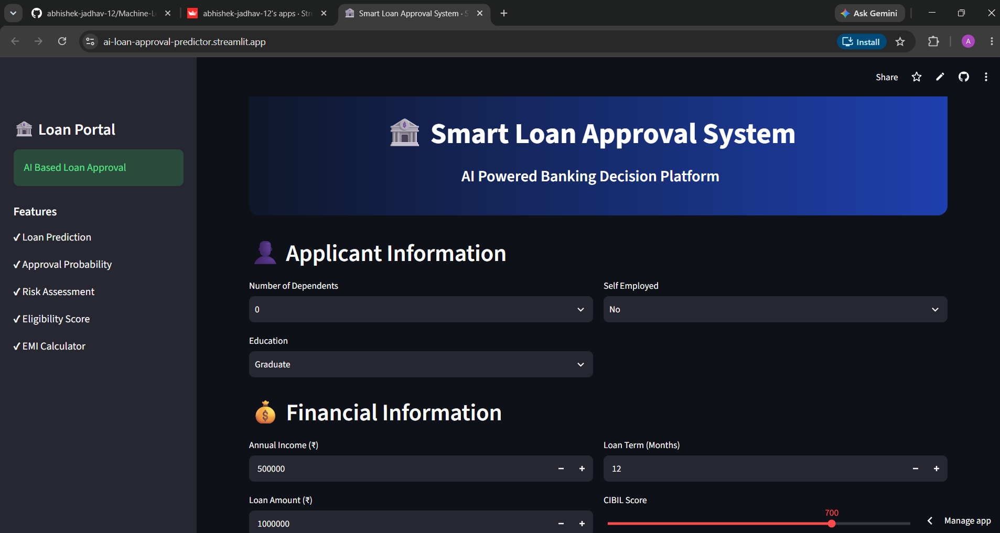
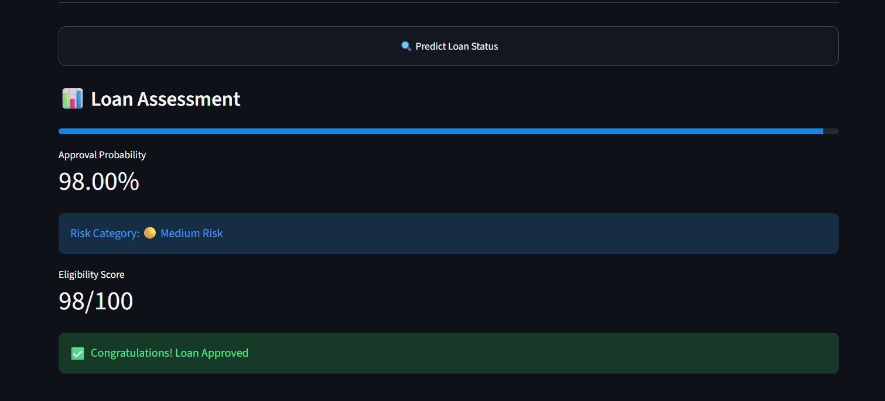

# 🏦 Smart Loan Approval Prediction System

An AI-powered Loan Approval Prediction System built using Machine Learning and Streamlit. This application predicts whether a loan application is likely to be approved based on an applicant's financial, employment, credit, and asset information.

The system uses a Random Forest Classifier trained on a real-world loan approval dataset and provides instant predictions through an interactive banking-style web interface.

---

## 🚀 Live Demo

🔗 **Live Application:** https://ai-loan-approval-predictor.streamlit.app/

---

## 📌 Features

* ✅ Loan Approval Prediction
* 📊 Approval Probability Score
* 🎯 Eligibility Score Calculation
* ⚠️ Risk Assessment using CIBIL Score
* 💳 EMI Calculator
* 🏠 Asset-Based Financial Analysis
* 📋 Applicant Information Summary
* 🎨 Modern Banking-Themed User Interface
* ⚡ Real-Time Predictions using Machine Learning

---

## 📸 Application Screenshots

### Home Page



### Loan Approval Prediction



### EMI Calculator


---

## 🛠️ Tech Stack

### Frontend

* Streamlit

### Backend

* Python

### Data Processing

* Pandas
* NumPy

### Machine Learning

* Scikit-Learn
* Random Forest Classifier
* StandardScaler

### Model Storage

* Joblib

---

## 📂 Project Structure

```text
loan-approval-predictor/
│
├── app.py
│
├── data/
│   └── loan_approval_dataset.csv
│
├── models/
│   ├── loan_model.pkl
│   └── scaler.pkl
│
├── notebooks/
│   └── loan_approval.ipynb
│
├── src/
│   ├── preprocess.py
│   ├── predict.py
│   └── train.py
│
├── assets/
│   ├── homepage.png
│   ├── prediction_approved.png
│   └── emi_calculator.png
│
├── requirements.txt
├── LICENSE
├── .gitignore
└── README.md
```

---

## 📊 Dataset Information

The project uses a Loan Approval Dataset containing applicant demographic and financial information.

### Input Features

| Feature                  | Description                |
| ------------------------ | -------------------------- |
| no_of_dependents         | Number of Dependents       |
| education                | Graduate / Not Graduate    |
| self_employed            | Employment Status          |
| income_annum             | Annual Income              |
| loan_amount              | Requested Loan Amount      |
| loan_term                | Loan Duration              |
| cibil_score              | Credit Score               |
| residential_assets_value | Residential Property Value |
| commercial_assets_value  | Commercial Property Value  |
| luxury_assets_value      | Luxury Asset Value         |
| bank_asset_value         | Bank Asset Value           |

### Target Variable

| Column      | Description         |
| ----------- | ------------------- |
| loan_status | Approved / Rejected |

---

## 🤖 Machine Learning Workflow

### Data Preprocessing

* Removed unnecessary columns
* Encoded categorical variables
* Standardized numerical features using StandardScaler

### Model Training

Algorithm Used:

```text
Random Forest Classifier
```

### Evaluation Metrics

* Accuracy Score
* Prediction Probability

### Model Performance

```text
Accuracy: ~97.78%
```

---

## ⚙️ Installation

### Clone Repository

```bash
git clone https://github.com/abhishek-jadhav-12/loan-approval-predictor.git
cd loan-approval-predictor
```

### Create Virtual Environment

```bash
python -m venv venv
```

### Activate Environment

Windows:

```bash
venv\Scripts\activate
```

Linux / Mac:

```bash
source venv/bin/activate
```

### Install Dependencies

```bash
pip install -r requirements.txt
```

### Run Streamlit Application

```bash
streamlit run app.py
```

---

## 🎯 Future Improvements

* SHAP Explainability
* PDF Report Generation
* Prediction History Tracking
* User Authentication
* Database Integration
* Cloud Deployment Enhancements
* Loan Recommendation Engine

---

## 📈 Learning Outcomes

Through this project, I gained practical experience in:

* Machine Learning Model Development
* Data Preprocessing
* Feature Engineering
* Model Deployment
* Streamlit Application Development
* Git & GitHub Workflow
* Software Project Structuring

---

## 👨‍💻 Author

### Abhishek Jadhav

Computer Science Engineering Student

Interests:

* Artificial Intelligence
* Machine Learning
* Data Science
* Quantum Computing

GitHub: https://github.com/abhishek-jadhav-12 

LinkedIn: https://www.linkedin.com/in/abhishek-s-jadhav

cd

---

## 📜 License

This project is licensed under the MIT License.

See the LICENSE file for more information.
